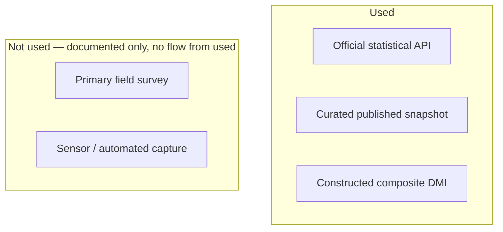

# acquisition_methods

```mermaid
flowchart TB
  subgraph used [Used]
    API[Official statistical API]
    SNAP[Curated published snapshot]
    CONS[Constructed composite DMI]
  end
  subgraph unused [Not used — documented only, no flow from used]
    SURV[Primary field survey]
    SENS[Sensor / automated capture]
  end
```
