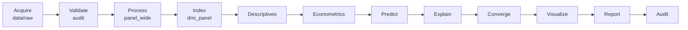

# assessment_pipeline

```mermaid
flowchart LR
  A[Acquire
data/raw] --> V[Validate
audit] --> P[Process
panel_wide] --> I[Index
dmi_panel]
  I --> S[Descriptives] --> E[Econometrics] --> M[Predict]
  M --> X[Explain] --> C[Converge] --> Viz[Visualize]
  Viz --> R[Report] --> Aud[Audit]
```
