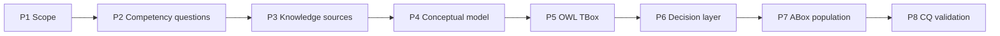

# construction_p1_p8

```mermaid
flowchart LR
  P1[P1 Scope] --> P2[P2 Competency questions]
  P2 --> P3[P3 Knowledge sources]
  P3 --> P4[P4 Conceptual model]
  P4 --> P5[P5 OWL TBox]
  P5 --> P6[P6 Decision layer]
  P6 --> P7[P7 ABox population]
  P7 --> P8[P8 CQ validation]
```
