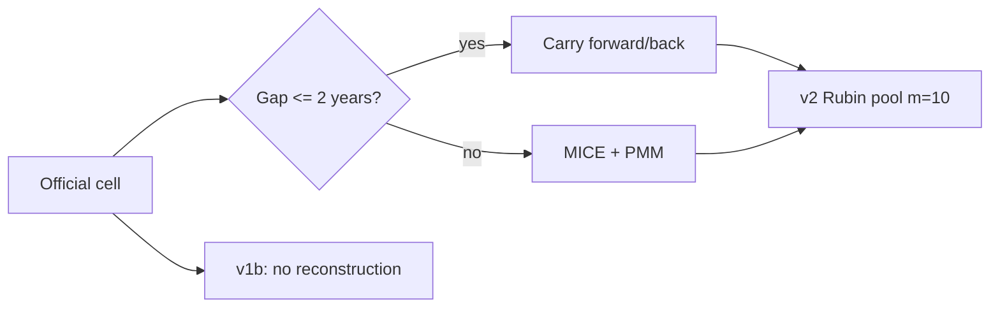

# missing_data_workflow

```mermaid
flowchart LR
  O[Official cell] --> G{Gap <= 2 years?}
  G -->|yes| C[Carry forward/back]
  G -->|no| M[MICE + PMM]
  C --> R[v2 Rubin pool m=10]
  M --> R
  O --> B[v1b: no reconstruction]
```
