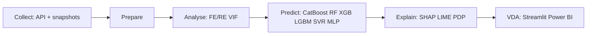

# model_to_phase

```mermaid
flowchart LR
  Collect[Collect: API + snapshots] --> Prepare[Prepare]
  Prepare --> Analyse[Analyse: FE/RE VIF]
  Analyse --> Predict[Predict: CatBoost RF XGB LGBM SVR MLP]
  Predict --> Explain[Explain: SHAP LIME PDP]
  Explain --> VDA[VDA: Streamlit Power BI]
```
