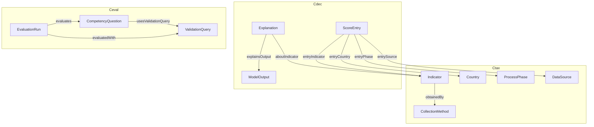

# ontology_layers

```mermaid
flowchart TB
  subgraph Ctax [Ctax]
    Indicator
    Country
    ProcessPhase
    DataSource
    CollectionMethod
  end
  subgraph Cdec [Cdec]
    ScoreEntry
    Explanation
    ModelOutput
  end
  subgraph Ceval [Ceval]
    EvaluationRun
    CompetencyQuestion
    ValidationQuery
  end
  ScoreEntry -->|entryIndicator| Indicator
  ScoreEntry -->|entryCountry| Country
  ScoreEntry -->|entryPhase| ProcessPhase
  ScoreEntry -->|entrySource| DataSource
  Indicator -->|obtainedBy| CollectionMethod
  Explanation -->|aboutIndicator| Indicator
  Explanation -->|explainsOutput| ModelOutput
  EvaluationRun -->|evaluates| CompetencyQuestion
  CompetencyQuestion -->|usesValidationQuery| ValidationQuery
  EvaluationRun -->|evaluatedWith| ValidationQuery
```
